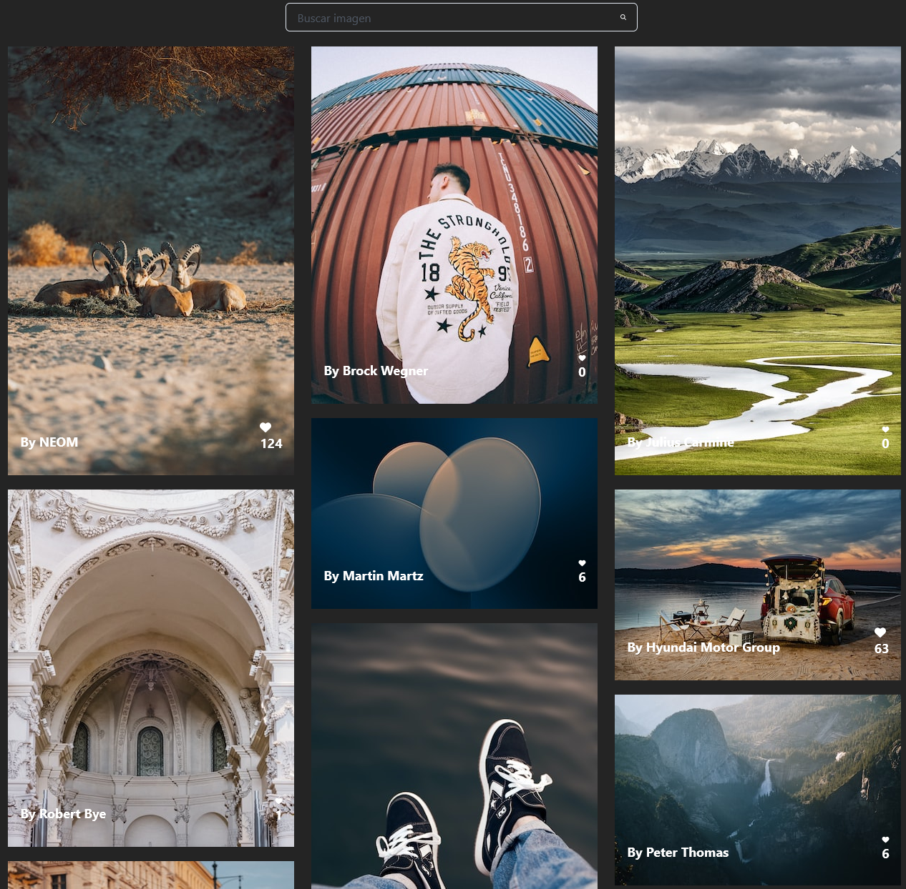

# Galeria-infinita-React.js

<h1 align="center">Galeria en React.js👋</h1>

### ⚙️ &nbsp;GitHub Analytics

  

 

Proyecto creado para la diplomatura de full-stack primer cuatrimestre(Front-end) donde mostramos lo aprendido en React.js, 
logica del lenguaje react.js (hooks,props,promise), logica de javascript, implementacion de APi mediante llamado(axios,Fetch),
y el manejo de paquetes como ChakraUI, Axios, etc.
En la misma se puede apreciar a primera vista imagenes ramdom sin fin, cada una de las imagenes contando con un ligthbox y un buscador el cual busca en la API
a medida que vamos tipeando el contenido y un resultado sin fin asi como algunas caracteristicas adiconales en cada una de las iamgenes. 

